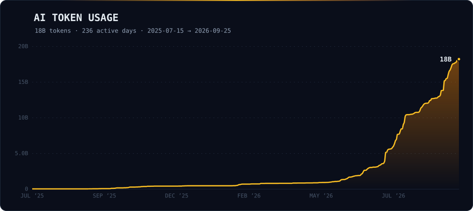

  

Hi, I'm **Jay (Jeremiah Clark)**. My Chinese name is **`永德恺`** (Yǒng Dé Kǎi). Most people just call me **`Jay`**.

- 🏛️ Based in **Atlanta, GA**. Studied Management Information Systems with a specialization in AI.
- 💼 Previously at **[LinkedIn](https://www.linkedin.com)** (Silicon Valley), **[Pinterest](https://www.pinterest.com)** (international expansion), and **[GGV Capital](https://www.ggvc.com)**.
- 👨‍💻 Currently building **[InterviewMaster.ai](https://interviewmaster.ai)** (AI-powered SQL interview prep · 3,000+ five-star reviews · 200+ questions from Google, Amazon, Meta, Apple) and **[Underscore Animation](https://underscore.ai)** (AI tooling for animators — `_Imagine`, `_Colorize`, `_Animate`).
- ✍️ Writing **[Perspective](https://jeremiah.so/perspective)** — a newsletter for family and friends on building, rejection, grit, Japan, and what turning 30 taught me.
- 🌍 I like ~~powder days in Niseko~~ skiing anywhere (Mt. Bachelor, Utah, Tahoe), learning **Chinese** and **Japanese**, the Réti Opening in chess, and anime.

If you're curious, my home on the internet is **[jeremiah.so](https://jeremiah.so)**.

For anything else, DM me on X **[@jeremiahoclark](https://twitter.com/jeremiahoclark)**.

⚡ **AI Usage Tracker** — Exploring If More Consumption Equals More Leverage

📝 **Recent Writing**
- [An Analysis of My Favorite Writer, Murakami](https://jeremiah.so/perspective/an-analysis-of-my-favorite-writer-murakami) — March 18, 2026
- [The Alter Ego Method](https://jeremiah.so/perspective/the-alter-ego-method) — March 16, 2026
- [The Score Takes Care of Itself](https://jeremiah.so/perspective/the-score-takes-care-of-itself) — October 11, 2025
- [Do It to Your Absolute Best](https://jeremiah.so/perspective/do-it-to-your-absolute-best) — June 27, 2025
- [[Founder Notes] Akio Morita](https://jeremiah.so/perspective/founder-notes-akio-morita) — March 1, 2025
